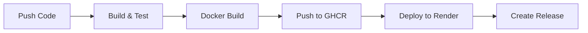

# 💬 Chat App

Real-time WebSocket chat application with automated CI/CD pipeline.

[](https://github.com/chinmayongithub/chat-app/actions/workflows/ci-cd.yml)
[](https://github.com/chinmayongithub/chat-app/pkgs/container/chat-app)
[](LICENSE)

---

## 🚀 Features

### Core Functionality
- ⚡ **Real-time Communication** - WebSocket-based instant messaging
- 👥 **Multi-user Support** - Handle multiple concurrent connections
- 🔐 **User Identification** - Username-based chat system
- 📡 **Connection Management** - Automatic reconnection handling
- 💬 **Message Broadcasting** - Efficient message distribution

### DevOps & Infrastructure
- 🐳 **Docker Containerization** - Multi-stage optimized builds
- 🔄 **CI/CD Pipeline** - Automated testing, building, and deployment
- 📦 **Container Registry** - GitHub Container Registry (GHCR)
- 🚀 **Auto Deployment** - Continuous deployment to Render
- 📊 **Monitoring** - Prometheus metrics and health checks
- 🏷️ **Versioned Releases** - Automatic semantic versioning
- 🔍 **Security Audits** - Nightly dependency scanning

---

## 📋 Table of Contents

- [Quick Start](#-quick-start)
- [Development](#-development)
- [Deployment](#-deployment)
- [Architecture](#-architecture)
- [Monitoring](#-monitoring)
- [CI/CD Pipeline](#-cicd-pipeline)
- [API Documentation](#-api-documentation)
- [Contributing](#-contributing)

---

## ⚡ Quick Start

### Prerequisites

- Node.js 20.x or higher
- npm or bun package manager
- Docker (optional, for containerized deployment)

### Local Development

```bash
# Clone the repository
git clone https://github.com/chinmayongithub/chat-app.git
cd chat-app

# Install dependencies
npm install

# Run in development mode
npm run dev

# Build for production
npm run build

# Start production server
npm start
```

The server will start on `http://localhost:8000`

### Using Docker

```bash
# Build the image
docker build -t chat-app .

# Run the container
docker run -d -p 8000:8000 --name chat-app chat-app

# Check health
curl http://localhost:8000/healthz
```

---

## 🛠️ Development

### Project Structure

```
chat-app/
├── .github/
│   └── workflows/
│       └── ci-cd.yml          # CI/CD pipeline configuration
├── scripts/
│   └── deploy_to_render.sh    # Deployment automation
├── dist/                       # Compiled JavaScript output
├── index.ts                    # Main application entry point
├── Dockerfile                  # Multi-stage Docker build
├── Jenkinsfile                 # Jenkins automation (optional)
├── sonar-project.properties    # Code quality configuration
├── tsconfig.json               # TypeScript configuration
└── package.json                # Project dependencies
```

### Available Scripts

| Command | Description |
|---------|-------------|
| `npm run dev` | Start development server with hot reload |
| `npm run build` | Build TypeScript to JavaScript |
| `npm start` | Start production server |
| `npm test` | Run test suite (if configured) |
| `npm run lint` | Run linter (if configured) |

### Environment Variables

```bash
PORT=8000                    # Server port (default: 8000)
NODE_ENV=production          # Environment mode
```

---

## 🚀 Deployment

### Automated Deployment (Recommended)

Every push to `main` branch automatically:
1. ✅ Runs tests and linting
2. ✅ Builds Docker image
3. ✅ Pushes to GitHub Container Registry
4. ✅ Deploys to Render
5. ✅ Creates GitHub Release

### Manual Deployment

#### Using Docker

```bash
# Pull latest image
docker pull ghcr.io/chinmayongithub/chat-app:latest

# Run container
docker run -d \
  -p 8000:8000 \
  --name chat-app \
  --restart unless-stopped \
  ghcr.io/chinmayongithub/chat-app:latest
```

#### Using Render

1. Connect your GitHub repository
2. Set environment to "Docker"
3. Configure port: `8000`
4. Deploy automatically on push

---

## 🏗️ Architecture

### Technology Stack

| Layer | Technology |
|-------|-----------|
| **Runtime** | Node.js 20.x LTS |
| **Language** | TypeScript 5.9 |
| **Framework** | Express.js 5.x |
| **WebSocket** | ws (WebSocket library) |
| **Monitoring** | Prometheus (prom-client) |
| **Containerization** | Docker (Alpine Linux) |
| **CI/CD** | GitHub Actions |
| **Deployment** | Render Platform |
| **Registry** | GitHub Container Registry |

### System Design

```
┌─────────────┐
│   Client    │
│  (Browser)  │
└──────┬──────┘
       │ WebSocket
       ▼
┌─────────────────────────────┐
│     Express Server          │
│  ┌─────────────────────┐   │
│  │  WebSocket Handler  │   │
│  └─────────────────────┘   │
│  ┌─────────────────────┐   │
│  │  Health Check API   │   │
│  └─────────────────────┘   │
│  ┌─────────────────────┐   │
│  │  Metrics Endpoint   │   │
│  └─────────────────────┘   │
└─────────────────────────────┘
       │
       ▼
┌─────────────────────────────┐
│    Prometheus Monitoring    │
└─────────────────────────────┘
```

---

## 📊 Monitoring

### Health Check

```bash
curl http://localhost:8000/healthz
```

**Response:**
```json
{
  "status": "ok",
  "timestamp": "2025-11-12T15:30:00.000Z"
}
```

### Metrics Endpoint

```bash
curl http://localhost:8000/metrics
```

**Available Metrics:**
- `websocket_connections_total` - Active WebSocket connections
- `websocket_messages_total` - Total messages by type
- `process_cpu_user_seconds_total` - CPU usage
- `process_resident_memory_bytes` - Memory usage
- `nodejs_eventloop_lag_seconds` - Event loop performance
- And more...

### Prometheus Integration

Add to your `prometheus.yml`:

```yaml
scrape_configs:
  - job_name: 'chat-app'
    static_configs:
      - targets: ['your-app.onrender.com:8000']
    metrics_path: '/metrics'
```

---

## 🔄 CI/CD Pipeline

### Pipeline Stages



### Workflow Triggers

- ✅ Push to `main` branch
- ✅ Pull requests
- ✅ Manual workflow dispatch

### Build Process

1. **Checkout** - Clone repository
2. **Setup** - Install Node.js 20.x
3. **Install** - Install dependencies (`npm ci`)
4. **Lint** - Run code quality checks
5. **Test** - Execute test suite
6. **Build** - Compile TypeScript
7. **Docker** - Build multi-stage image
8. **Push** - Upload to container registry
9. **Deploy** - Trigger production deployment
10. **Release** - Create versioned release

---

## 📚 API Documentation

### WebSocket Events

#### Client → Server

**Identify User**
```json
{
  "type": "identify",
  "username": "john_doe"
}
```

**Send Message**
```json
{
  "type": "message",
  "text": "Hello, world!"
}
```

#### Server → Client

**System Message**
```json
{
  "system": true,
  "message": "john_doe joined the chat"
}
```

**User Message**
```json
{
  "id": "abc123",
  "username": "john_doe",
  "message": "Hello, world!",
  "system": false
}
```

### HTTP Endpoints

| Endpoint | Method | Description |
|----------|--------|-------------|
| `/healthz` | GET | Health check endpoint |
| `/metrics` | GET | Prometheus metrics |

---

## 📄 License

MIT License - see [LICENSE](LICENSE) file for details.

---

Made with ❤️ by [chinmayongithub](https://github.com/chinmayongithub)
